# Layering on health centers

For this hands-on exercise, we'll add the locations of [Federally Qualified Health Centers][] to our [CA county map of poverty rates](mapping_poverty_README.md). 

[FQHCs](https://bphc.hrsa.gov/about/what-is-a-health-center/index.html) are a little-known but important piece of the American health-care system. The 1,400-plus centers nationwide provide affordable primary-care services to more than 27 million underserved and uninsured people.

They have played an important role in [disaster recovery](https://www.tribtalk.org/2018/11/12/embrace-community-health-centers-as-a-crucial-part-of-texas-disaster-response/) and serve an [increasing number of people in California](https://www.chcf.org/publication/californias-federally-qualified-health-centers/).

Here's a [doctor's perspective](http://www.wshc.org/news-item/taking-closer-look-importance-federally-qualified-health-centers/) on the vital role of FQHCs, and how their funding is under threat.

This exercise will focus on simply overlaying the location of FQHCs on our thematic map of poverty rates by county. 

Keep in mind that this has limited use journalistically, and is mainly intended to demonstrate how to map point data with Google Fusion Tables, and overlay that point data on a thematic map.

A more rigorous and useful analysis might entail using GIS software to compare service coverage areas (such as this [Palo Alto example](https://bphc.hrsa.gov/uds/images/map/2017/GranteeSA2017_LALCS00001.jpg)) with demographic information relevant to those coverage areas.

Such an analysis could explore how well health centers and their delivery sites match the needs of populations in their coverage areas, and whether there are gaps in coverage or over-delivery of services in particular areas.

Some Montana researchers, for example, are looking at "pregnancy-related outcomes and disparities," according to this [press release](https://www.eurekalert.org/pub_releases/2018-10/msu-msr102918.php).

## Getting the data

For this exercise, we'll use the  Health Resources & Services Administration's [Data Portal][] to download the location of FQHC sites in California.

> There are more than 2000 sites in California affiliated with a much smaller number of parent organizations. 

Once you're on the [Data Portal][]:

* Find the "Primary Dataset" options
* Select the `Health Center Service Delivery and Look-Alike Sites`
* Click `Choose Indicators` in the lower right of the page

On the next page:

* Choose `All Sites`
* Click `View Data` in the lower right corner of page

When prompted, click the `Select all available` option for indicators:

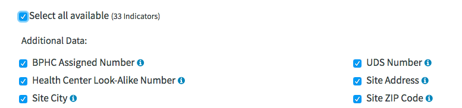

Click `View Data` in the lower right corner of page.

The results page shows a data preview of all sites across America. Let's filter this data by state to reduce the size of the data. 

Enter CA in the box under the `Site State Abbreviation` field:

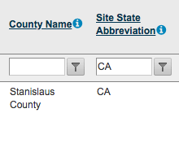

Click the filter icon next to the box and select `EqualTo`:

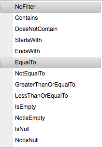

> It will take a few seconds for the filter to run.

Once the filtering is complete, download the CSV version of the results by clicking the `CSV` button in the `Datasets Export` area of the page:

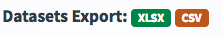

The downloaded file should be called: `HDWDataPortal.zip`. Move the file to a sensible location (e.g. `~/Desktop/poverty_map/data`) and unzip it. You should see two new files. The one containing our data is `Primary Dataset - EHB Site.csv`.

## Import data in Fusion Tables

We're now ready to import `Primary Dataset - EHB Site.csv` into Fusion Tables.

We'll repeat the steps we performed earlier during the [poverty rate mapping tutorial](docs/mapping_poverty_README.md). 

> We'll condense the steps for brevity here, but please refer back to the other tutorial for a more visual step-by-step.

* Go to Google Drive
* Click `New -> More -> Google Fusion Tables`
* When the table import wizard appears, click `Choose File` and navigate to `Primary Dataset - EHB Site.csv`
*  Click `Next`
*  Click `Next` again when the data preview appears (the header row should be shaded gray)
*  Give the new table a more readable name, e.g. `ca_health_center_sites`
*  Click `Finish`

## Viewing the Fusion map

Our health center data includes Latitude and Longitude fields, and Google Fusion 
is smart enough to auto-detect these coordinate fields. 

You can view the map of the locations by simply clicking the `Map of Latitude` tab.

> NOTE: While this data set makes it easy to map locations, Fusion Tables offers a handy [geocoding](https://support.google.com/fusiontables/answer/1012281?hl=en) feature that can translate cities, counties and street addresses to latitudes and longitudes.

Congratulations! You now have a map of all the health center sites in California!

## Exploring more Fusion featues

Let's explore a few additional features of Fusion tables using this data set.

### Filtering data

The data includes both sites where patient services are provided, as well purely administrative locations. Say that we want to exclude the adminstrative locations.

Fusion tables lets you add one or more filters to the data using the `Filter` button below the `File` menu.

Let's filter the data by the `Services Delivered at Site` field:

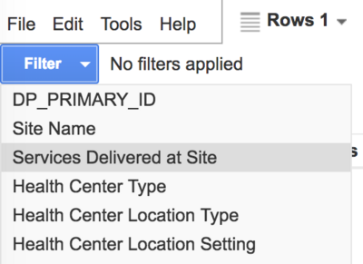

Now, let's select only those facilities marked as `Yes':

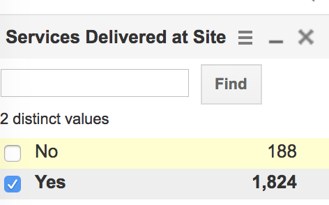

The map should now display only the sites flagged as delivering services.

### Creating Heatmaps

Fusion tables also provides a heatmap feature, which can be a useful way to visualize the density of points on a map.

Let's click the `Heatmap` button to see how the visual changes. With a single click, we can see that FQHC sites are especially prevalent in San Francisco and San Jose in the Bay Area (as denoted by the red zones).

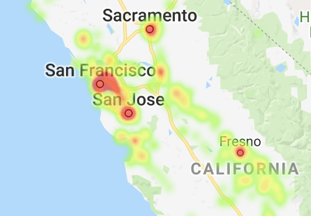

But wait, something is wrong. We saw on our point map that Los Angeles had a 
large -- perhaps the largest -- number of health center sites in California. Why is this area not appearing as a red zone similar to San Francisco?

It turns out that the Heatmap feature of Fusion Tables has a limit of 1000 rows. So it's likely that our data is being truncated. The [Fusion Tables Heatmap docs](https://support.google.com/fusiontables/answer/1152262) suggest filtering your data to stay under the 1000-record limit. 

You could alternatively try a different tool such as Flourish or Tableau for this kind of visual display.

*When creating heatmaps in Fusion tables, be sure to keep this limit in mind!*

## Fixing the pop-ups

Let's switch our map back to displaying points for now and clean up the pop-up
info box.  Again, this was covered in the poverty map, so we'll be brief:

* Click `Feature map`
* Click `Change info window`
* In the "Automatic" tab, select only the name and location-related fields: `Site Name`, `County Name`, `Site Address`, `Site City`, `Site Zip Code`
* In the "Custom" tab, let's dial down the clutter by removing the word "Site" from the labels.
* Click "Save"

## Publish

We're now ready to publish. Again, see the last tutorial for a visual guide on these steps:

* Click `Tools -> Publish`
* Click `Change visibility`
* Click the `change` link next to Privacy
* Select `On - Public on the web`
* Click `Save`
* Click `Done`

## Mashing up the maps

Our final step involves creating a map mash-up that overlays health center locations atop our map of poverty rates for CA counties. 

We'll use a third-party tool called [Fusion Tables Layer Wizard][] to help generate HTML and javascript that we could theoretically drop onto a website or into a publishing system such as WordPress.

> Note: In order to use such a solution on a world-facing website, you would need to add a [Google Maps API key](https://developers.google.com/maps/documentation/javascript/get-api-key) to the code and ensure it has [appropriate restrictions](https://developers.google.com/maps/api-key-best-practices).

* Gather the public URLs for the [poverty map](https://fusiontables.google.com/data?docid=1v82zW0leTB83u_Q-GERcoF_WWLLkjTtBoe1Hhk_e#map:id=3) and [health center map](https://fusiontables.google.com/data?docid=1xMn6Rj--EwmWbx6qv1pQ_p-hnYJ1EyDyrexFhNZa#map:id=3). This requires going to `Tools -> Publish` in each Fusion Table and grabbing the first link from the pop-up.
* Go to [Fusion Tables Layer Wizard][]
* In the area that says `Add map layers`, enter the link to the poverty map in the first blue box in the `Embed link` field and click `Put layer on map`
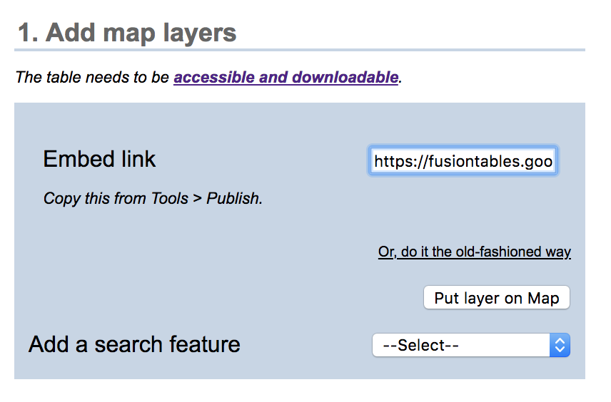
* Now click the `Add layer` button (below the blue box) and repeat the above process for the health centers link.

> It's important that you add layers in order from the "bottom up", since each new layer sits atop the previous. Adding the poverty map second would prevent the health center points from appearing on this multi-layer map.

The final configuration should appear as below:

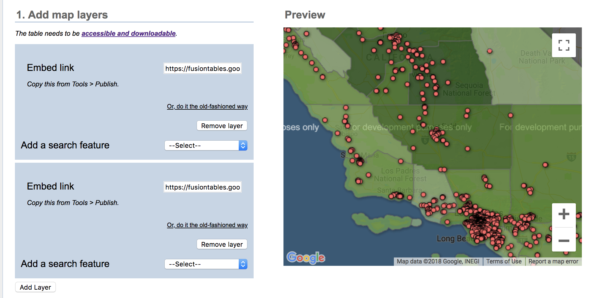

At the bottom of the page under Step 4 (we'll skip the other configuration options for now), you should see a window containing HTML, css and javascript.

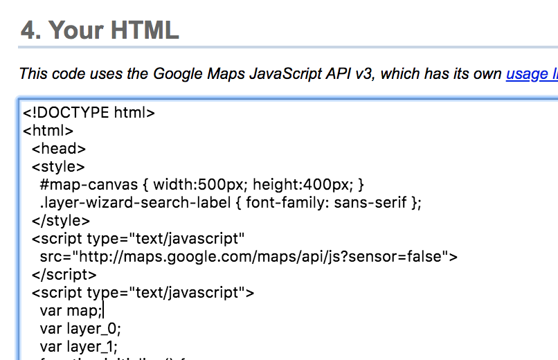

Copy this code to a text file called `ca_poverty_and_fqhc_sites.html` and open it in your browser to view the final product.

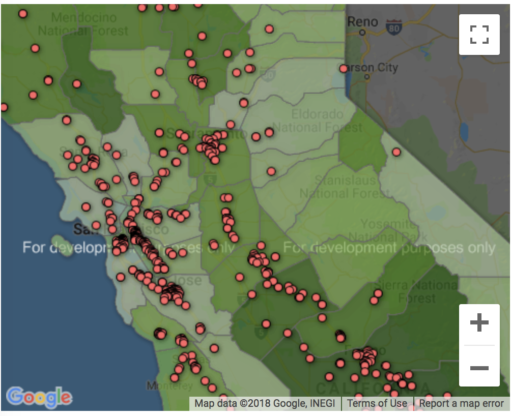

## Resources

* [Fusion Tables Layer Wizard](https://www.datavizforall.org/fusion/wizard/)
* HRSA [Data Portal][]

[Data Portal]: https://data.hrsa.gov/hdw/tools/DataPortal.aspx
[Federally Qualified Health Centers]: https://bphc.hrsa.gov/about/index.html
[Fusion Tables Layer Wizard]: http://htmlpreview.github.io/?https://github.com/fusiontable-gallery/fusion-tables-api-samples/blob/master/FusionTablesLayerWizard/src/index.html