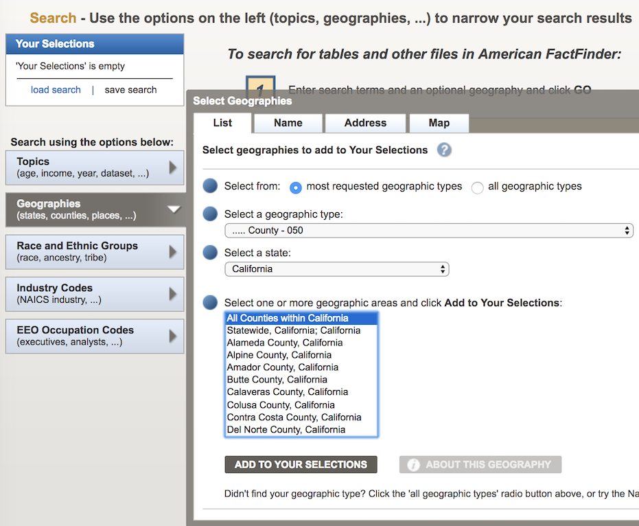

# Mapping Poverty Rates

For this hands-on exercise, we'll map poverty rates in California by county.

## Poverty Rates

First, let's level up on on how the government measures [poverty](https://en.wikipedia.org/wiki/Poverty#Measuring_poverty). It's a complicated endeavor, to say the least...

* Crash course in measuring poverty, courtesy of the [West Wing](https://www.youtube.com/watch?v=q9EehZlw-zk)
* [NYT: U.S. Recovery Eludes Many Living Below Poverty Level, Census suggests](https://www.nytimes.com/2018/09/13/us/politics/poverty-rate-census-bureau.html)
* [Income and Poverty in the United States: 2017](https://www.census.gov/content/census/en/library/publications/2018/demo/p60-263.html)


## Acquring Cenus Poverty Data

### Finding County Poverty Data

* Go To [American FactFinder](https://factfinder.census.gov/faces/nav/jsf/pages/index.xhtml)
* Select `Advanced Search` -> `Show Me All`

First, we'll add the Geographic component to our data:

* Choose `Geographies` and select the below options:
  * Select a geographic type: `County - 050`
  * Select a state: `California`
  * Select one or more geographic areas...: `All Counties within California`
* Click `Add to your selections`



Next, we'll add the poverty data for counties:

* Choose `Topics`
* Then drill down to `People` -> `Poverty` and click on `Poverty`
* Then click the `ClOSE X` button in the `Topics` pop-up


You should now have a filtered list of data sets.
Select the file called `S1701 POVERTY STATUS IN THE PAST 12 MONTHS` from the 2016 ACS 5-year estimate.


> Note, we're using this file because 5-year estimates are generally more accurate and this includes data for all 58 CA counties, whereas the most recent 2017 1-year estimate only contains data for 40 counties.

### Pre-filtering the Census data

Before we download this table, let's use the FactFinder wizard to make it easier to work with downstream.

Select the `Modify Table` button above the table. 

Once that's done:

* Collapse all the subgroups under the various demographic groupings such as AGE, EDUCATIONAL ATTAINMENT, etc.
* In the leftmost column header (`Subject`):
  * Click the top filter and select `HC03` to limit the results to the Percent below poverty level
    
  * Click the bottom filter and select `EST` only
    


### Download/unpack the data

Next, click `Download`, select `Use the data to...` and click OK.

 

Once the zipfile is generated, download it.

Next, fire up the Terminal and execute the following commands:

```
# Create a new directory for the data
mkdir -p ~/Desktop/poverty_map
cd ~/Desktop/poverty_map

# Move and unpack the Census zipfile
# NOTE THE DOT at the end of the next line!!
mv ~/Downloads/ACS_16_5YR_S1701.zip . 
unzip ACS_16_5YR_S1701.zip
```

After following the above steps, you should see several
files in the `poverty_map` folder. Next, we'll peform
a few more manual cleanups on the Census data as preparation for import into Google Fusion Tables.

### Prepping the data

Let's use Excel to open our main data file (`ACS_16_5YR_S1701_with_ann.csv`) and remove extraneous columns and header rows.

* Once the the file is open, delete the first header row.
* Next, delete the `id` and `id2` columns at the far left.
* Now delete all columns from `C` through to the end. 

> Select column C and then hit SHIFT + COMMAND + right arrow to quickly select the range of columns through the end.

Let's also simplify the name of the second column to `Percent below poverty level`.

Finally, click `File -> Save As` and save the edits to a new file called `ca_poverty_by_county.csv`.

You should now have a table that looks like this:


## Fusion tables

Google Fusion Tables is a useful and relatively simple tool for generating thematic maps. It offers a number of features that will let us [merge](https://support.google.com/fusiontables/answer/171254?hl=en) our Census poverty data with county boundaries for California.

### Import data to a Google Fusion Table

* Open up your Google Drive folder.
* Click the `New` button and select the `More` dropdown menu.
* Select `Google Fusion Tables`

> If you don't see an option for `Google Fusion Tables`, click `Connect more apps` and search for and enable it.


In the `Import new table` wizard:

 * Click `Choose File`
 * Select the file that we prepared earlier (`ca_poverty_by_county.csv`) 


 * Click `Next`
 * Click `Next` when you see the import preview
 * Click `Finish` on the metadata section of wizard

The data should have imported into Fusion Tables.

Next, we'll merge this data with county boundaries and map the poverty levels.


## Fusion tables public data

Google Fusion has a number of pre-generated [public use data tables][] that can help with mapping, including state, congressional district and county boundaries.

We'll use the [California Counties Fusion table/map][].

> Generating this file on our own would require working with the raw [Census Cartographic Boundary][] files, which are in a format known as Keyhole Markup Language (KML)

In order to map our poverty rates, we'll need to merge our data by county name with the CA boundaries table provided by Google Fusion:

* Click `File -> Merge...`


A merge wizard should pop up. Paste the link to the [California Counties Fusion table/map][] in the bottom of window where it says `Or paste a web address here` and click `Next`:


In the next wizard screen, select the fields on which to merge the tables. Choose `Geography` for the poverty table and `Geographic Name` as the field for the California Counties table.


You should see a data preview that shows identical values in both columns. If everything looks good, click `Next` and then click `Merge`.

### If the merge fails

If the above merge process fails with an error such as this... 


...you should make a copy of the CA counties table and repeat the merge steps above. This time, however, you should supply the URL to your new copy of the CA Counties table. This is an admittedly annoying but widely recommended work-around for this error.

## Styling the map

Once you've merged the tables, we'll want to shade the counties based on their poverty levels.

To do so, click through to the new table and click the "Map of geometry" tab. Select the drop-down menu in the corner of the tab and click `Change Map` to call up the map configuration menu.


Under "Feature map", click `Change feature styles` and do the following:

* Click "Fill color" under "Polgyons"
* Click the "Gradient" tab
* Select "Show a Gradient"
* Make sure Column is set to "Percent below poverty level"
* Click "use this range", which trims the range to the lowest and highest levels in the data
* Click "Save"


After you click save, the map should re-render using the gradient you just configured.


## Clean up the info window

We should also clean up the details in the pop-up windows
for all the counties.

In the map configuration area, click "Change info window".

In the Automatic tab, uncheck everything except for `Geography` and `Percent below poverty level`.


Next, head over to the Custom tab and change the "Geography" label to "County".


Finally, click "Save". The pop-up information box should now reflect those changes.


## Publishing the map

If you plan to publish the map, go to `Tools -> Publish`:


Click the "Change visibility" link in yellow highlighted area:


Click the "Change" link next to Private:


Select the "Public on the web" option and click "Save":


You can now share the link to this map or use the iframe or HTML provided by Fusion Tables to embed it on a web page.


[California Counties Fusion table/map]: https://fusiontables.google.com/DataSource?docid=196LqydLhOq1Wl9612hNhcGoh4vUmRjTaiFvDhA#rows:id=1
[Census Cartographic Boundary]: https://www.census.gov/geo/maps-data/data/kml/kml_counties.html
[public use data tables]: https://support.google.com/fusiontables/answer/1182141?hl=en